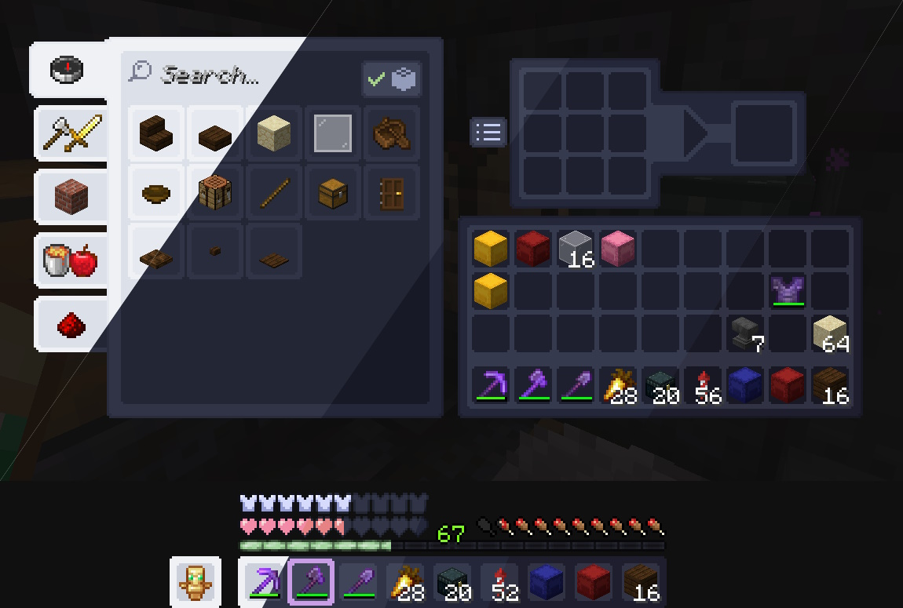
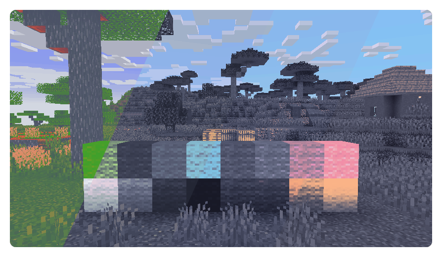

<h3 align="center">
	 
	
	Catppuccin for <a href="https://minecraft.net">Minecraft</a>
	
</h3>

	
	
	

	
	

## Usage

### Resource Pack
1. Go to our Modrinth [versions page](https://modrinth.com/resourcepack/catppuccin-ui/versions) and click on version with your preferred flavor and the Minecraft version you're playing.
2. Scroll down to the "Files" section and download `Catppuccin {flavor} {accent color}.zip` zip file with your preferred accent color.
3. Move that zip file you downloaded to your `resourcepacks` folder in your `.minecraft` folder.
4. Launch Minecraft and open resource packs menu from options.
5. Select the pack and press done.

### Shaders
1. Install Iris and Sodium
2. Download a `catppuccin-shaders.zip` zip file from the [releases](https://github.com/catppuccin/minecraft/releases) page
3. Move it to your shader packs folder
4. Go to Options -> Video -> Shader Packs
5. Select it
6. Set the flavor in the shader settings

## 💝 Thanks to

- [Tnixc](https://github.com/Tnixc)
- [Aurniox](https://github.com/Aurn1ox)
- [CallMeEcho](https://github.com/CallMeEchoCodes)
- [Locotay](https://github.com/andreasgrafen)
- [mvilk](https://github.com/mvilk)
- [Gingeh](https://github.com/Gingeh)
- [VoidTwo](https://github.com/VoidTwo)

&nbsp;

	

	Copyright &copy; 2021-present <a href="https://github.com/catppuccin" target="_blank">Catppuccin Org</a>

	

